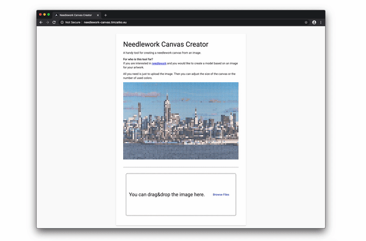

# Needlework Canvas Creator

---

A handy tool for creating a needlework canvas from an image.

## For who is this tool for?

If you are interested in [needlework](https://en.wikipedia.org/wiki/Needlework) and you would like to create a model based on an image for your artwork.

## How does it work?

The uploaded image is downsized, and the dominant colors are extracted from it, then the model is created. The number of colors can be adjusted also the size of the model.

## Contributing

Information on the contribution guidelines are in the [CONTRIBUTING.md](./CONTRIBUTING.md).
